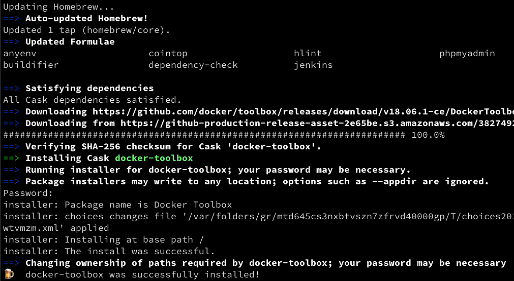
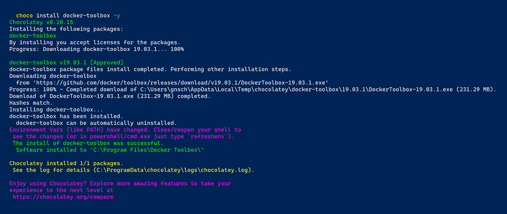
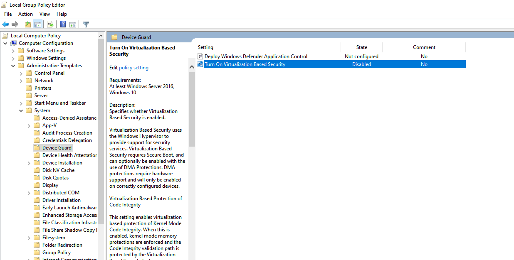
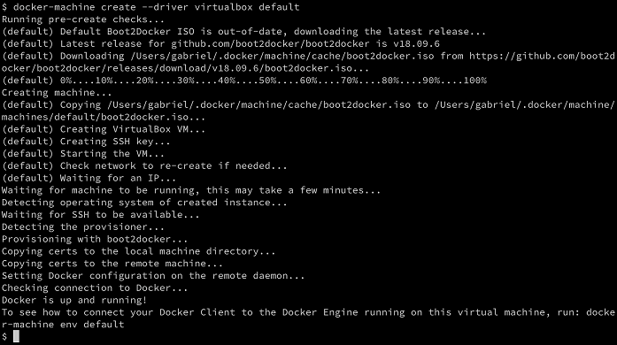
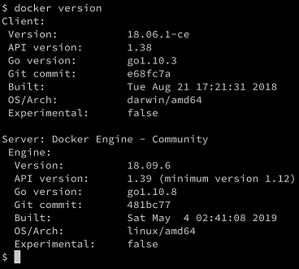
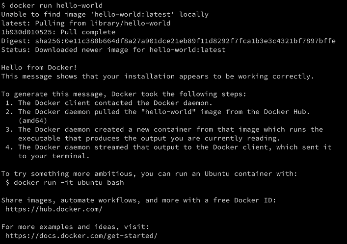

# Installing Docker Toolbox
Docker Toolbox has been available for developers for a few years. It precedes newer tools such as Docker for Desktop. The Toolbox allows a user to work very elegantly with containers on any macOS or Windows computer. Containers must run on a Linux host. Neither Windows nor macOS can run containers natively. Hence, we need to run a Linux VM on our laptop, where we can then run our containers. Docker Toolbox installs VirtualBox on our laptop, which is used to run the Linux VMs we need.

- **Note:** As a Windows user, you might already be aware that there are so-called Windows containers that run natively on Windows, and you are right. Microsoft has ported Docker Engine to Windows and it is possible to run Windows containers directly on Windows Server 2016 or newer, without the need for a VM. So, now we have two flavors of containers, Linux containers and Windows containers. The former only runs on a Linux host and the latter only runs on a Windows server. In this book, we are exclusively discussing Linux containers, but most of the things we'll learn also apply to Windows containers.


Let's start by installing the Docker Toolbox on a macOS.

# Installing Docker Toolbox on macOS
Follow these steps for installation:

Open a new Terminal window and use Homebrew to install the toolbox:
``
$ brew cask install docker-toolbox 
``
You should see something like this:



Installing Docker Toolbox on macOS

- To verify that Docker Toolbox has been installed successfully, try to access **docker-machine** and **docker-compose**, two tools that are part of the installation:
```
$ docker-machine --version
docker-machine version 0.15.0, build b48dc28d
$ docker-compose --version
docker-compose version 1.22.0, build f46880f
```

Next, we will install Docker Toolbox on Windows.

# Installing Docker Toolbox on Windows
Open a new Powershell window in admin mode and use Chocolatey to install Docker Toolbox:

```
PS> choco install docker-toolbox -y
```
The output should look similar to this:



Installing Docker Toolbox on Windows 10
We will now be setting up Docker Toolbox.

## If Hyper-V was previosly installed



```dos
bcdedit /set hypervisorlaunchtype off
```


# Setting up Docker Toolbox
Follow these steps for setup:

L-et's use **docker-machine** to set up our environment. First, we list all Docker-ready VMs we have currently defined on our system. If you have just installed Docker Toolbox, you should see the following output:


List of all Docker-ready VMs

- OK, we can see that there is a single VM called default installed, but it is currently in the STATE of stopped. Let's use docker-machine to start this VM so we can work with it:

```
$ docker-machine start default
```
This produces the following output:


Starting the default VM in Docker Toolbox

- If we now list the VMs again, we should see this:


Listing the running VMs in Docker Toolbox

- The IP address used might be different in your case, but it will definitely be in the **192.168.0.0/24**range. We can also see that the VM has Docker version **18.06.1-ce** installed.

If, for some reason, you don't have a default VM or you have accidentally deleted it, you can create it using the following command:

```
docker-machine create — driver hyperv — hyperv-virtual-switch 
"External Virtual Switch" manager1
```

- https://docs.docker.com/machine/drivers/hyper-v/
- https://rominirani.com/docker-machine-windows-10-hyper-v-troubleshooting-tips-367c1ea73c24

This will generate the following output:



Creating a new default VM in Docker Toolbox

If you carefully analyze the preceding output, you will see that **docker-machine** automatically downloaded the newest ISO file for the VM from Docker. It realized that my current version was outdated and replaced it with version **v18.09.6**.

To see how to connect your Docker client to the Docker Engine running on this virtual machine, run the following command:
```
$ docker-machine env default
```
This outputs the following:

```
export DOCKER_TLS_VERIFY="1"
export DOCKER_HOST="tcp://192.168.99.100:2376"
export DOCKER_CERT_PATH="/Users/gabriel/.docker/machine/machines/default"
export DOCKER_MACHINE_NAME="default"
# Run this command to configure your shell:
# eval $(docker-machine env default)
```

- We can execute the command listed on the last line in the preceding code snippet to configure our Docker CLI to use Docker running on the default VM:
```
$ eval $(docker-machine env default)
```
And now we can execute the first Docker command:
```
$ docker version
```
This should result in the following output:

 

Output of docker version


- We have two parts here, the client and the server part. The client is the CLI running directly on your macOS or Windows laptop, while the server part is running on the **default** VM in VirtualBox.

Now, let's try to run a container:
```
$ docker run hello-world
```

This will produce the following output:

 

The preceding output confirms that Docker Toolbox is working as expected and can run containers.

- **Tip :** Docker Toolbox is a great addition even when you normally use Docker for Desktop for your development with Docker. Docker Toolbox allows you to create multiple Docker hosts (or VMs) in VirtualBox and connect them to a cluster, on top of which you can run Docker Swarm or Kubernetes.