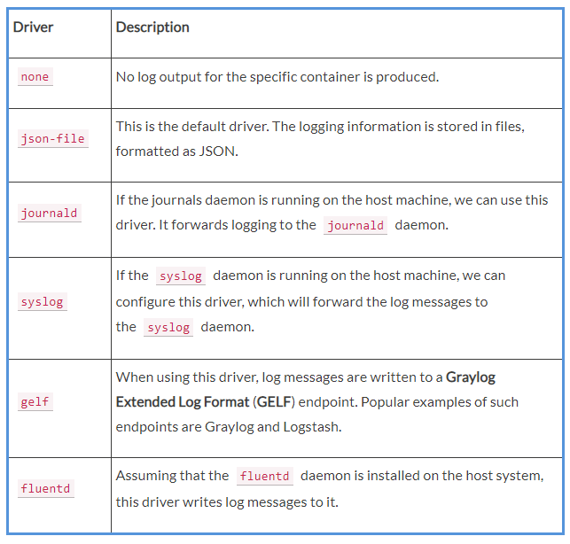

# Retrieving container logs
It is a best practice for any good application to generate some logging information that developers and operators alike can use to find out what the application is doing at a given time, and whether there are any problems to help to pinpoint the root cause of the issue.

When running inside a container, the application should preferably output the log items to **STDOUT** and **STDERR**and not into a file. If the logging output is directed to **STDOUT** and **STDERR**, then Docker can collect this information and keep it ready for consumption by a user or any other external system:

- To access the logs of a given container, we can use the docker container logs command. If, for example, we want to retrieve the logs of our trivia container, we can use the following expression:

```
$ docker container logs trivia
```

This will retrieve the whole log produced by the application from the very beginning of its existence.

- **Note:** Stop, wait a second—this is not quite true, what I just said. By default, Docker uses the so-called json-file logging driver. This driver stores the logging information in a file. And if there is a file rolling policy defined, then docker container logs only retrieves what is in the current active log file and not what is in previous rolled files that might still be available on the host.

If we want to only get a few of the latest entries, we can use the **-t** or **--tail** parameter, as follows:

```
$ docker container logs --tail 5 trivia
```

This will retrieve only the last five items the process running inside the container produced.

Sometimes, we want to follow the log that is produced by a container. This is possible when using the **-f** or **--follow** parameter. The following expression will output the last five log items and then follow the log as it is produced by the containerized process:

```
$ docker container logs --tail 5 --follow trivia 
```

Often using the default mechanism for container logging is not enough. We need a different way of logging. This is discussed in the following section.

# Logging drivers
Docker includes multiple logging mechanisms to help us to get information from running containers. These mechanisms are named **logging drivers**. Which logging driver is used can be configured at the Docker daemon level. The default logging driver is json-file. Some of the drivers that are currently supported natively are as follows:



- **Note:**  If you change the logging driver, please be aware that the docker container logs command is only available for the json-file and journald drivers.

# Using a container-specific logging driver
We have seen that the logging driver can be set globally in the Docker daemon configuration file. But we can also define the logging driver on a container by container basis. In the following example, we are running a **busybox** container and use the **--log-driver** parameter to configure the none logging driver:

```
docker container run --name test -it --log-driver none   busybox sh -c 'for N in 1 2 3; do echo "Hello $N"; done'
```

We should see the following:

```
Hello 1
Hello 2
Hello 3 
```
Now, let's try to get the logs of the preceding container:


```
$ docker container logs test
```

The output is as follows:

```
Error response from daemon: configured logging driver does not support reading
```
This is to be expected since the **none** driver does not produce any logging output. Let's clean up and remove the **test** container:

```
$ docker container rm test
```

# Advanced topic – changing the default logging driver
Let's change the default logging driver of a Linux host:

The easiest way to do this is on a real Linux host. For this purpose, we're going to use Vagrant with an Ubuntu image:

```
$ vagrant init bento/ubuntu-17.04
$ vagrant up
$ vagrant ssh
```

Vagrant is an open source tool developed by Hashicorp that is often used for building and maintaining portable virtual software development environments.

Once inside the Ubuntu VM, we want to edit the Docker daemon configuration file. Navigate to the **/etc/docker**folder and run **vi** as follows:
```
$ vi daemon.json  
```
Enter the following content:

```
{
  "Log-driver": "json-log",
  "log-opts": {
    "max-size": "10m",
    "max-file": 3
  }
}
```

Save and exit vi by first pressing **Esc** and then typing **:w:q** and finally hitting the **Enter**key.


The preceding definition tells the Docker daemon to use the **json-log** driver with a maximum log file size of 10 MB before it is rolled, and the maximum number of log files that can be present on the system is **3** before the oldest file gets purged.

Now we have to send a **SIGHUP** signal to the Docker daemon so that it picks up the changes in the configuration file:

```
$ sudo kill -SIGHUP $(pidof dockerd)
```

Note that the preceding command only reloads the config file and does not restart the daemon.