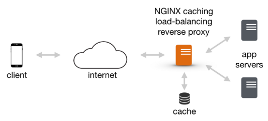
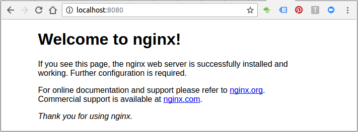

# Reverse proxy - V1
A reverse proxy is a server that sits between internal applications and external clients, forwarding client requests to the appropriate server. Because NGINX has a number of advanced load balancing, security, and acceleration features that most specialized applications lack, using NGINX as a reverse proxy enables us to add these features to any application.

In this post, we'll setup a reverse proxy with NGINX, and will setup two applications (one on NGINX and another on apache).




Dockerfile - building a reverse proxy image
Here is the Dockerfile which will be used to create the reverse proxy image. It will use the nginx.conf after copying it to the proxy container:

```
FROM nginx:alpine
COPY nginx.conf /etc/nginx/nginx.conf
```
We're using nginx 1.15.7. To check the version, we can add the following to the Dockerfile because the alpine docker image doesn't have bash installed by default:

```
RUN apk update && apk add bash
RUN apk add net-tools
RUN apk add iputils
```
Then, check its version:

```
$ docker build -t docker-alpine .
$ docker run -t -i docker-alpine /bin/bash
bash-4.4# nginx -v
nginx version: nginx/1.15.7
```
Once it's done, we may want to remove the line we've just added since it will increase the size of the image.


# Let's build reverse proxy image:
```
$ docker build -t reverseproxy .
Sending build context to Docker daemon 4.608 kB
Step 1/2 : FROM nginx:alpine
alpine: Pulling from library/nginx
627beaf3eaaf: Pull complete 
d7d23baed7e7: Pull complete 
7ded693c7a29: Pull complete 
6856facfdc93: Pull complete 
Digest: sha256:ebd2b85803e78100a582385f7eac56cd367561f0f2bab005f784cda95818d41f
Status: Downloaded newer image for nginx:alpine
 ---> 5a35015d93e9
Step 2/2 : COPY nginx.conf /etc/nginx/nginx.conf
 ---> 3e31efad8bda
Removing intermediate container edd9450463ad
Successfully built 3e31efad8bda
```
## We can check the create image:
```
$ docker images
REPOSITORY     TAG      IMAGE ID       CREATED              SIZE
reverseproxy   latest   3e31efad8bda   About a minute ago   15.5 MB
```
Note that we copied the following nginx.conf to our reverse proxy container:
```
nginx.conf:

worker_processes 1;
 
events { worker_connections 1024; }
 
http {
 
    sendfile on;
 
    upstream docker-nginx {
        server nginx:80;
    }
 
    upstream docker-apache {
        server apache:80;
    }
 
    server {
        listen 8080;
 
        location / {
            proxy_pass         http://docker-nginx;
            proxy_redirect     off;
            proxy_set_header   Host $host;
            proxy_set_header   X-Real-IP $remote_addr;
            proxy_set_header   X-Forwarded-For $proxy_add_x_forwarded_for;
            proxy_set_header   X-Forwarded-Host $server_name;
        }
    }
 
    server {
        listen 8081;
 
        location / {
            proxy_pass         http://docker-apache;
            proxy_redirect     off;
            proxy_set_header   Host $host;
            proxy_set_header   X-Real-IP $remote_addr;
            proxy_set_header   X-Forwarded-For $proxy_add_x_forwarded_for;
            proxy_set_header   X-Forwarded-Host $server_name;
        }
    }
}
```
We set worker_processes explicitly to 1 which is the default value. It is common practice to run 1 worker process per core. For more about it, check [Thread Pools in NGINX Boost Performance 9x!](https://www.nginx.com/blog/thread-pools-boost-performance-9x/).


The worker_connections sets the maximum number of simultaneous connections that can be opened by a worker process (default=1024).

The sendfile is usually essential to speed up any web server via passing the pointers (without copying the whole object) straight to the socket descriptor. However, we use NGINX as a reverse proxy to serve pages from an application server, we can deactivate it.

The upstream directive in ngx_http_upstream_module defines a group of servers that can listen on different ports. So, the upstream directive is used to define a pool of servers.

Nginx can proxy requests to servers that communicate using the http(s), FastCGI, SCGI, and uwsgi, or memcached protocols through separate sets of directives for each type of proxy (Module ngx_http_upstream_module).

After defining the upstream servers, we need to tell NGINX how to listen and how to react to requests.

The most straight-forward type of proxy involves handing off a request to servers that can communicate using http. This type of proxy is known as a generic "proxy pass" and is handled by proxy_pass directive.

The proxy_pass directive is mainly found in location contexts, and it sets the protocol and address of a proxied server. When a request matches a location with a proxy_pass directive inside, the request is forwarded to the URL given by the directive.


 
The proxy_pass directive is what makes a configuration a reverse proxy. It specifies that all requests which match the location block (in this case the root / path) should be forwarded to a specific port on a specified host where the app is running.

In the above configuration snippet, no URI is given at the end of the server in the proxy_pass definition. For definitions that fit this pattern, the URI requested by the client will be passed to the upstream server as-is.

So, if we try to access the host machine via port 8080, NGINX will act as a reverse proxy and serve whatever is in the proxy_pass definition. In the above scenario, we have docker-nginx which is the name of one of our upstream servers, which means the nginx service will be served.

The request coming from NGINX on behalf of a client will look different than a request coming directly from a client. A big part of this is the headers that go along with the request. When NGINX proxies a request, it automatically makes some adjustments to the request headers it receives from the client:

NGINX gets rid of any empty headers.
The "Host" header is re-written to the value defined by the $proxy_host variable. This will be the IP address or name and port number of the upstream, directly as defined by the proxy_pass directive.


Host, X-Real-IP, and X-Forwarded-For
To adjust or set headers for proxy connections, we can use the proxy_set_header directive. The proxy_set_header allows redefining or appending fields to the request header passed to the proxied server. The syntax looks like this:
```
proxy_set_header field value;
```
In the configuration, we're passing an unchanged "Host" request header field like this:
```
proxy_set_header Host $host;
```
The above request sets the "Host" header to the $host variable, which should contain information about the original host being requested. The X-Real-IP is set to the IP address of the client so that the proxy can correctly make decisions or log based on this information.

The X-Forwarded-For (XFF) header is a list containing the IP addresses of every server the client has been proxied through up to this point.


 
The XFF header is a standard header for identifying the originating IP address of a client connecting to a web server through an HTTP proxy or a load balancer. When traffic is intercepted between clients and servers, server access logs contain the IP address of the proxy or load balancer only. To see the original IP address of the client, the XFF request header is used.

The XFF header is typically set by a proxy server or a load balancer to indicate who the real requester is.

This header is used for debugging, statistics, and generating location-dependent content and by design it exposes privacy sensitive information, such as the IP address of the client. Therefore the user's privacy must be kept in mind when deploying this header.

In our case, we set this to the $proxy_add_x_forwarded_for variable. This variable takes the value of the original XFF header retrieved from the client and adds the NGINX server's IP address to the end. In other words, the $proxy_add_x_forwarded_for variable is used to automatically append $remote_addr to any incoming XFF headers.


For more readable code, we could move the proxy_set_header directives out to the server or http context, allowing it to be referenced in more than one location:
```
worker_processes 1;
  
events { worker_connections 1024; }

http {

    sendfile on;

    upstream docker-nginx {
        server nginx:80;
    }

    upstream docker-apache {
        server apache:80;
    }
    
    proxy_set_header   Host $host;
    proxy_set_header   X-Real-IP $remote_addr;
    proxy_set_header   X-Forwarded-For $proxy_add_x_forwarded_for;
    proxy_set_header   X-Forwarded-Host $server_name;
    
    server {
        listen 8080;
 
        location / {
            proxy_pass         http://docker-nginx;
            proxy_redirect     off;
        }
    }
 
    server {
        listen 8081;
 
        location / {
            proxy_pass         http://docker-apache;
            proxy_redirect     off;
        }
    }
}
```
 

For more on reverse proxy setup: Understanding Nginx HTTP Proxying, Load Balancing, Buffering, and Caching and Module ngx_http_proxy_module


# docker-compose.yml
With Compose, we define a multi-container application in a single file, then spin our application up in a single command which does everything that needs to be done to get it running.

The main function of Docker Compose is the creation of microservice architecture, meaning the containers and the links between them.

Compared with docker commands, the docker-compose commands are not only similar, but they also behave like docker counterparts. The only difference is that docker-compose commands affect the entire multi-container architecture defined in the docker-compose.yml configuration file and not just a single container.

There are three steps to using Docker Compose:

Define each service in a Dockerfile.
Define the services and their relation to each other in the docker-compose.yml file.
Use docker-compose up to start the system.

Here is our docker-compose.yml:
```
services:
    reverseproxy:
        image: reverseproxy
        ports:
            - 8080:8080
            - 8081:8081
        restart: always
 
    nginx:
        depends_on:
            - reverseproxy
        image: nginx:alpine
        restart: always
 
    apache:
        depends_on:
            - reverseproxy
        image: httpd:alpine
        restart: always
```
A services definition contains configuration which will be applied to each container started for that service, much like passing command-line parameters to docker run.

The depends_on expresses dependency between services and the docker-compose up will start services in dependency order.


Let's create and start containers in detached mode (run containers in the background).
```
$ docker-compose up -d
Creating network "proxy_default" with the default driver
Pulling apache (httpd:alpine)...
alpine: Pulling from library/httpd
627beaf3eaaf: Already exists
e225632b13fc: Pull complete
09d704230c42: Pull complete
a1f05d6d2879: Pull complete
f9e9b4770efc: Pull complete
Digest: sha256:2b943ffb79a69deb138af7358c37ceb21ab9e2919fa76f72158c541f17ad76d2
Status: Downloaded newer image for httpd:alpine
Creating proxy_reverseproxy_1
Creating proxy_nginx_1
Creating proxy_apache_1
```
The docker-compose up command is a shorthand form of docker-compose build and docker-compose run.

When complete, we should have three containers deployed, two of which we cannot access directly:
```
$ docker ps
CONTAINER ID   IMAGE         COMMAND                 CREATED             STATUS              PORTS                                      NAMES
6387bd547b9b   httpd:alpine  "httpd-foreground"      About an hour ago   Up About an hour    80/tcp                                     proxy_apache_1
9cc97c9d35a5   nginx:alpine  "nginx -g 'daemon ..."  About an hour ago   Up About an hour    80/tcp                                     proxy_nginx_1
d8b794c74359   reverseproxy  "nginx -g 'daemon ..."  About an hour ago   Up About an hour    80/tcp, 0.0.0.0:8080-8081->8080-8081/tcp   proxy_reverseproxy_1
```

We can check our applications (one with NGINX and the other one with apache).

Navigate to http://localhost:8080, and this will hit the NGINX reverse proxy which will in turn load the NGINX web application:



Then, navigate to http://localhost:8081, the NGINX reverse proxy will be hit and the Apache web application will be loaded:


To stop container gracefully:
```
$ docker-compose stop
```
The command stops the process in a running container. The main process inside the container will receive SIGTERM, and after a grace period, SIGKILL.

To remove (and stop) the container by docker-compose up, we can use docker-compose down. By default, it only removes containers and networks created by up. But with additional options it removes volumes (--volumes or -v option), and images (--rmi all or --rmi local).

```
$ docker-compose down
```

