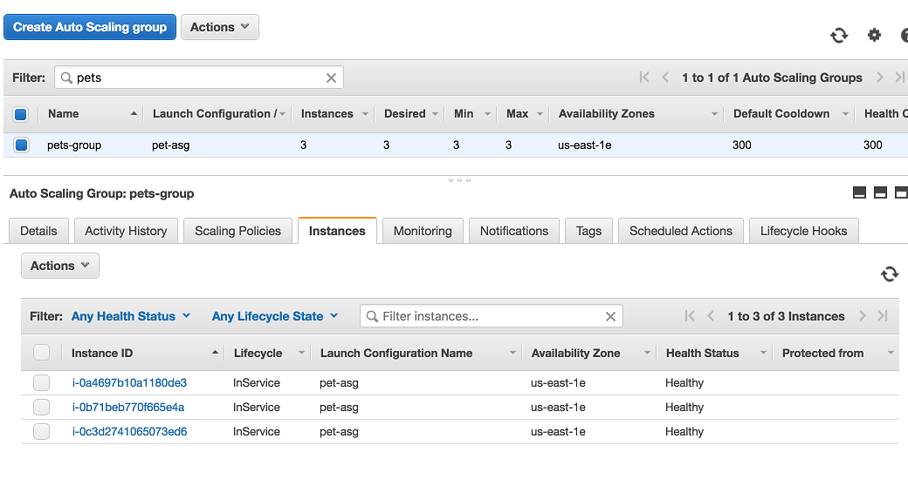
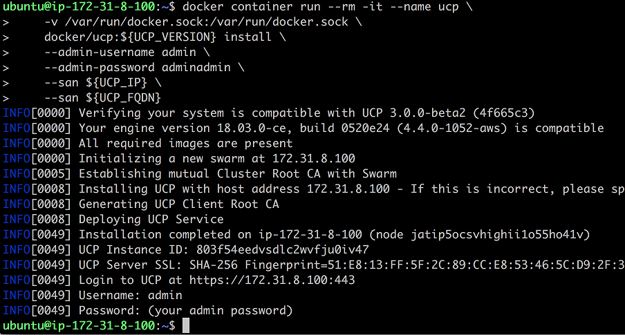
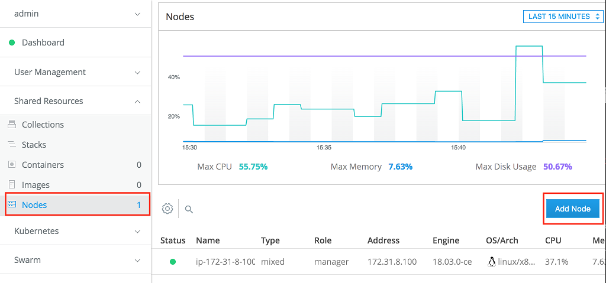
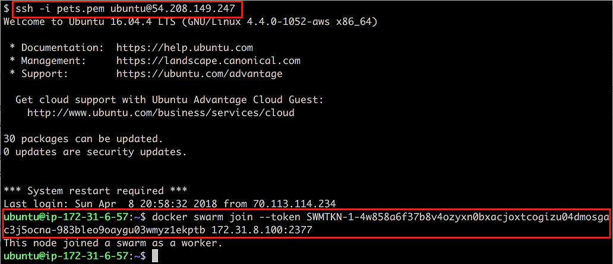
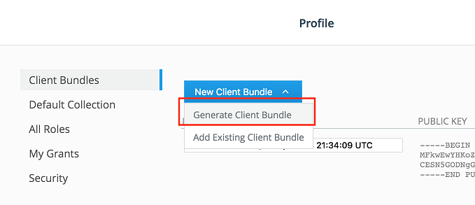
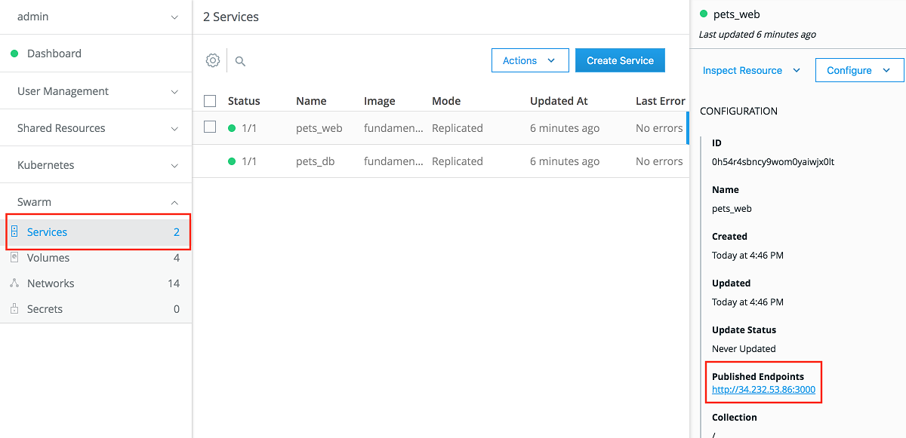
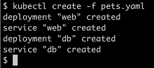

# Deploying and using Docker EE on AWS
In this section, we're going to install Docker **Universal Control Plane (UCP)** version 3.0. UCP is part of Docker's enterprise offering and supports two orchestration engines, Docker Swarm and Kubernetes. UCP can be installed in the cloud or on-premises. Even hybrid clouds are possible with UCP.

To try this, you need a valid license for Docker EE or you can claim a free test license on Docker Store.

# Provisioning the infrastructure
In this first section, we are going to set up the infrastructure needed to install Docker UCP. This is relatively straightforward if you are somewhat familiar with AWS. Let's do this by following these steps:

- Create an **Auto Scaling group (ASG)** in AWS using the Ubuntu 16.04 server AMI. Configure the ASG to contain three instances of size **t2.xlarge**. Here is the result of this:



ASG on AWS ready for Docker EE

- Once the ASG has been created, and before we continue, we need to open the **security group (SG)** a bit (which our ASG is part of) so that we can access it through SSH from our laptop and also so that the **virtual machines (VMs)** can communicate with each other.

- Navigate to your SG and add two new inbound rules, which are shown here:


AWS SG settings

In the preceding screenshot, the first rule allows any traffic from my personal laptop (with the IP address **`70.113.114.234`**) to access any resource in the SG. The second rule allows any traffic inside the SG itself. These settings are not meant to be used in a production-like environment as they are way too permissive. However, for this demo environment, they work well.

Next, we will show you how to install Docker on the VMs we just prepared.

# Installing Docker
After having provisioned the cluster nodes, we need to install Docker on each of them. This can be easily achieved by following these steps:

- SSH into all three instances and install Docker. Using the downloaded key, SSH into the first machine:
```
$ ssh -i pets.pem ubuntu@<IP address>
```
Here, **`<IP address>`** is the public IP address of the VM we want to SSH into. 

- Now we can install Docker. For detailed instructions, refer to https://dockr.ly/2HiWfBc. We have a script in the**~/lab-15-Cloud/sample/aws** folder called install-docker.sh that we can use.

- First, we need to clone the labs GitHub repository to the VM:
```
git clone https://github.com/Fredy-SSA/DJK.git
cd ~/Lab-15-Coud/sample/aws
```

- Then, we run the script to install Docker:

```
 ./install-docker.sh
```

Once the script is finished, we can verify that Docker is indeed installed using **sudo docker version**. Repeat the preceding code for the two other VMs.

- **Note** :**sudo** is only necessary until the next SSH session is opened to this VM since we have added the **ubuntu** user to the **docker** group. So, we need to exit the current SSH session and connect again. This time, **sudo**should not be needed in conjunction with **docker**.

Next, we will show how to install Docker UCP on the infrastructure we just prepared.

# Installing Docker UCP
We need to set a few environment variables, as follows:

```
$ export UCP_IP=<IP address>
$ export UCP_FQDN=<FQDN>
$ export UCP_VERSION=3.0.0-beta2
```

Here, **`<IP address>`** and **`<FQDN>`** are the public IP address and the public DNS name of the AWS EC2 instance we're installing in UCP.

After that, we can use the following command to download all the images that UCP needs:

```
$ docker run --rm docker/ucp:${UCP_VERSION} images --list \
    | xargs -L 1 docker pull
```
Finally, we can install UCP:



Installing UCP 3.0.0-beta2 on a VM in AWS

Now, we can open a browser window and navigate to **`https://<IP address>`**. Log in with your username, **`admin`**, and password, **`adminadmin`**. When asked for the license, upload your license key or follow the link to procure a trial license.

Once logged in, on the left-hand side under the Shared Resources section, select Nodes and then click on the Add Node button:



Adding a new node to UCP

In the subsequent Add Node dialog box, make sure that the node type is Linux and the Worker node role is selected. Then, copy the **docker swarm join** command at the bottom of the dialog box. SSH into the other two VMs you created and run this command to have the respective node join the Docker swarm as a worker node:



Joining a node as a worker to the UCP cluster

Back in the web UI of UCP, you should see that we now have three nodes ready, as shown here:


List of nodes in the UCP cluster

By default, worker nodes are configured so that they can only run the Docker Swarm workload. This can be changed in the node details, though. In this, three settings are possible: Swarm only, Kubernetes only, or mixed workload. Let's start with Docker Swarm as the orchestration engine and deploy our pets application.

# Using remote admin for the UCP cluster

To be able to manage our UCP cluster remotely from our laptop, we need to create and download a so-called client bundle from UCP. Proceed with the following steps:

- In the UCP web UI, on the left-hand side under admin, select the My Profile option.
- In the subsequent dialog, select the New Client Bundle option and then Generate Client Bundle:



Generating and downloading a UCP client bundle

- Locate the downloaded bundle on your disk and unzip it.
- In a new Terminal window, navigate to that folder and source the **env.sh** file:
- 
```
$ source env.sh
```

You should get an output similar to this:

```
Cluster "ucp_34.232.53.86:6443_admin" set.
User "ucp_34.232.53.86:6443_admin" set.
Context "ucp_34.232.53.86:6443_admin" created.
```

Now, we can verify that we can indeed remotely access the UCP cluster by, for example, listing all the nodes of the cluster:


Listing all the nodes of our remote UCP cluster
In the next section, we will look at how to deploy the pets application as a stack using Docker Swarm as the orchestration engine.

# Deploying to Docker Swarm
It is now time to deploy our distributed application to our cluster orchestrated by Docker Swarm. Follow these steps to do so:

In the Terminal, navigate to the **~/Lab-15-Cloud/sample/ucp** folder and create the **pets** stack using the **stack.yml** file:


Deploying the pets stack into the UCP cluster

- In the UCP web UI, we can verify that the stack has been created:


The pets stack listing in the UCP web UI

- To test the application, we can navigate to Services under the main menu, Swarm. The list of services running in the cluster will be displayed as follows:



Details of the 'web' services of the pets stack

In the preceding screenshot, we see our two services, web and db, of the pets stack. If we click on the web service, its details are displayed on the right-hand side. There we find an entry, Published Endpoints.

- Click on the link and our pets application should be displayed in the browser.

When done, remove the stack from the console with the following:

```
$ docker stack rm pets
```

Alternatively, you can try to remove that stack from within the UCP web UI.

# Deploying to Kubernetes
From the same Terminal that you used to remotely access the UCP cluster to deploy the pets application as a stack using Docker Swarm as the orchestration engine, we can now try to deploy the pets application to the UCP cluster using Kubernetes as the orchestration engine.

Make sure you're still in the **~/Lab-15-Cloud/sample/ucp** folder. Use **kubectl** to deploy the pets application. First, we need to test that we can get all the nodes of the cluster with the Kubernetes CLI:


Getting all the nodes of the UCP cluster using the Kubernetes CLI

Apparently, my environment is configured correctly and **kubectl** can indeed list all the nodes in the UCP cluster. That means I can now deploy the pets application using the definitions in the **pets.yaml** file:



Creating the pets application in the UCP cluster using the Kubernetes CLI

We can list the objects created by using kubectl get all. In a browser, we can then navigate to **`http://<IP address>:<port>`** to access the pets application, where **<IP address>** is the public IP address of one of the UCP cluster nodes and **<port>** is the port published by the **web** Kubernetes service.

We have created a cluster of three VMs in an AWS ASG and have installed Docker and UCP 3.0 on them. We then deployed our famous pets application into the UCP cluster, once using Docker Swarm as the orchestration engine and once Kubernetes. 

Docker UCP is a platform-agnostic container platform that offers a secure enterprise-grade software supply chain in any cloud and on-premises, on bare metal, or in virtualized environments. It even offers freedom of choice when it comes to orchestration engines. The user can choose between Docker Swarm and Kubernetes. It is also possible to run applications in both orchestrators in the same cluster.